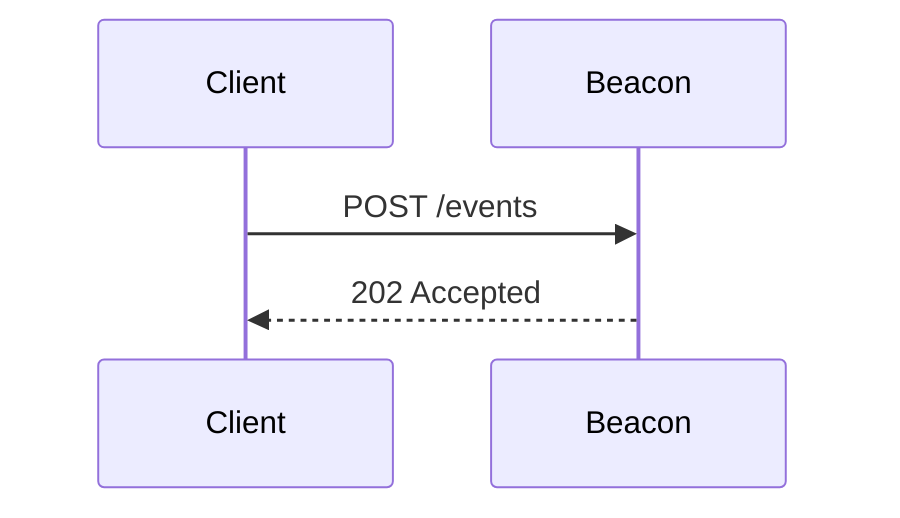

# MDX Authoring

Beacon MDX mixes prose with a small component vocabulary. Consistency matters
more than cleverness — readers jump between pages, and structural surprise
slows them down.

## File anatomy

```mdx
---
title: "Authenticating API Requests"
description: "Use HMAC-signed requests or API keys to authenticate against the Beacon API."
category: api
order: 2
draft: false
---
import { Callout, CodeGroup, Steps } from '~/components/mdx';

## Overview

Beacon supports two authentication methods: …

<Callout type="info">
  New to Beacon? Start with [Getting Started](./getting-started).
</Callout>

## API keys

API keys are issued per workspace. Each key has a name and a scope.

<Steps>
  1. Open **Settings → API keys**
  2. Click **Create key**
  3. Scope the key to the minimum needed
</Steps>

## Example request

```bash
curl https://api.beacon.example.com/v1/events \
  -H "Authorization: Bearer $BEACON_KEY"
```
```

## Component vocabulary

Only these components are imported in content:

| Component | Purpose | Allowed props |
| --- | --- | --- |
| `<Callout>` | Info, warning, danger notes | `type: 'info' \| 'warning' \| 'danger'` |
| `<CodeGroup>` | Tabbed code (e.g., curl / JS / Python) | `default: string` (initial tab) |
| `<Steps>` | Numbered procedure | — |
| `<Aside>` | Sidebar call-out (right rail on desktop) | — |
| `<Figure>` | Image + caption | `src, alt, caption` |

Anything more interactive belongs in a Preact island component, not inline MDX.

## Headings

- `title` in frontmatter becomes the H1 — NEVER write `# Title` in body
- Section headings start at H2
- Don't skip levels (H2 → H4). Restructure instead.
- Every heading generates a slug anchor; don't hand-write them

## Code blocks

- Every code block sets a language. ` ```ts` / ` ```bash` / ` ```astro`. For plain text use ` ```text`.
- Use Shiki line highlighting for walkthroughs: ` ```ts {2,4-6}`
- For multi-language examples, wrap in `<CodeGroup>`:

```mdx
<CodeGroup default="curl">
```bash title="curl"
curl https://api.beacon.example.com/v1/events
```

```ts title="JavaScript"
const res = await fetch('https://api.beacon.example.com/v1/events');
```
</CodeGroup>
```

## Diagrams

Use Mermaid fenced blocks — they render at build time via `remark-mermaidjs`.

````mdx

````

Keep diagrams small — 3–6 participants. For anything larger, link to a
diagrams.net file.

## Links

- Internal: `[setup](./setup)` — relative paths resolve through the dynamic route
- Cross-category: `[auth](../api/authentication)`
- External: `[OpenAPI](https://spec.openapis.org/)` — auto-opens in new tab via `rehype-external-links`

Never use absolute URLs to our own domain.

## Images

```mdx
import { Image } from 'astro:assets';
import heroImg from '~/assets/docs/auth-flow.png';

<Figure
  src={heroImg}
  alt="Sequence diagram of the HMAC-signed request flow"
  caption="HMAC authentication flow from client to Beacon API."
/>
```

- `alt` must describe the image's content, not say "image of..."
- `caption` is for additional context, not a repeat of the alt text
- Always use `<Image>` from `astro:assets` — never raw ``

## Don't

- Don't use raw HTML inside MDX (`<div>`, `<span>`) unless wrapping a component that requires it
- Don't import React components — Beacon uses Preact; React imports break the build
- Don't paste Mermaid render output (SVG) into the file — write the source
- Don't use blockquotes (`>`) for callouts — use `<Callout>`
- Don't embed live iframes pointing at dev servers — they break in production
